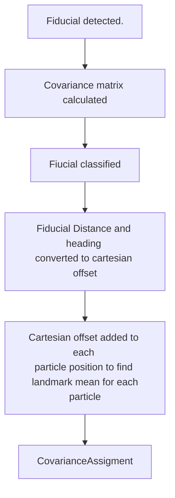

# Landmark Detections

This document will explain how landmarks are detected and assigned to particles. At the moment, we are not handling any fastSLAM in this step, but this will change in the future.



All this is handled in the following code block:

````python
def add_landmark(particles, polar_landmark_detection):
        cartesian_landmark_offset = get_landmark_offset(
        particles, 
        polar_landmark_detection
        )

        cartesian_landmark_positions = cartesian_landmark_offset + particles.poses[:, :2] #This is just the x and y position of each particle.
        
        lm_covariances = get_landmark_cov(polar_landmark_detection, SENSOR_COVARIANCE)
        
        particles.add_landmark(cartesian_landmark_positions)
        particles.add_covariance(lm_covariances)
````

 :
