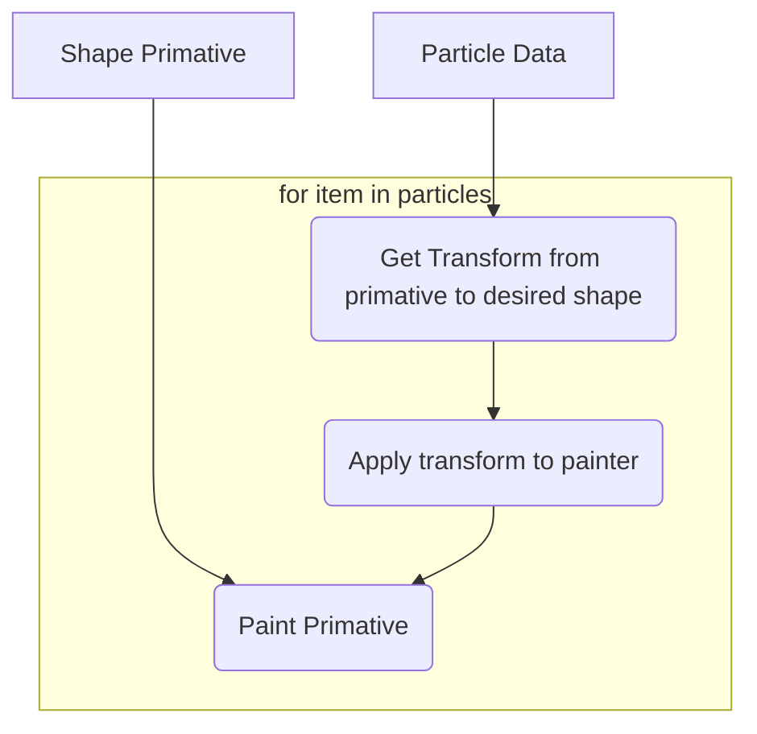

# Particle Viewer:
The particle viewer is a particle filter visualiser, written in PyQT. This should have significant perofrmance improvements over a graohing solution like MatPlotLib. Its also an excuse for me (jack) to learn some PyQt.

## Basic Structure - V2:
Particle filters have lots of different hypotheses of the same objects position in space. In code this means that the graphics engine needs to desplay a lot of identical objects, drawn with slightly different attributes. Initially, the particle visualiser was structured like this:

The simple approach, of assigning each particle a seperate QGraphicsItem object is just t

# transform approach:
Luckily, all our main primitives (arrows, dots and Concentration Ellipses) can all be expressed as linear transformations of a primitive shape. A triangle for the arrow class, and a circle for the concentration ellipse class!
This means we can use the following approach to draw representations of our data onto our QGraphicsView:

