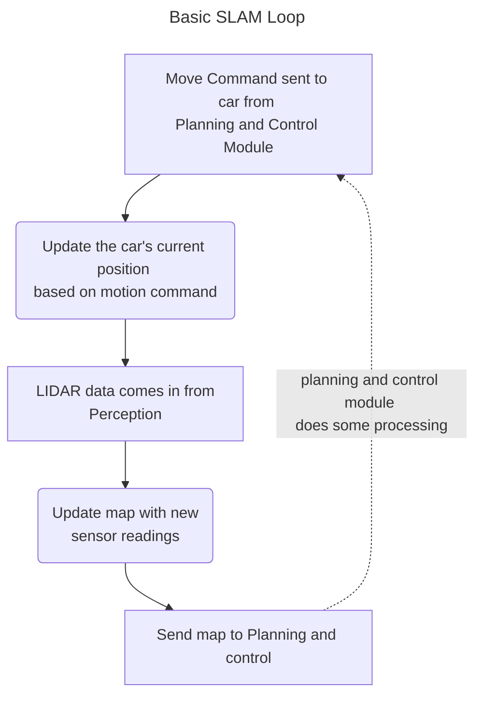

# What is SLAM?

SLAM stands for *Simultaneous Localisation and Mapping*. SLAM is intereted in answering two questions: *where is the robot in space?* and *Can we map the robots environment?* . We want to create a map showing the robot where it can and can't go, then find the current position of the robot. Once the robot knows where it is and where it can go, it can plan a route that will keep it on track. Put like this, this sounds like an easy problem, and it's something that humans are **very** good at naturally. As we'll see, its not so easy to program a car to do this from scratch, for a few reasons.

## What SLAM Isn't:

Although we do a lot in SLAM, we offload some responsability to other teams within UWE: Whenever We talk about 'mapping the environment', we 

## SLAM Basics:

In theory, SLAM is an easy problem. We run a loop with four main steps:

- **STEP 1: The motion command:** We tell the robot how it should move.
- **STEP 2: Motion Update:** We calculate where the robot will be when we reach the next step.
- **STEP 3: Observation:** We use the robot's sensors to find the position of nearby objects relative to the robot.
- **STEP 4: Observation Update:** We use the robot's position and orientation information found in the Motion update step to add new objects to the map.

These four steps have been applied to our AI robot in the flow chart below. We receive sensor data from Perception and motion update steps from planning and control

> **Note:** If you see some code rather than a flow diagram here, you need some way to view Mermaid diagrams. Mermaid diagrams are a way to generate flow chart diagrams using code. If you write notes on a computer, you should check Mermaid out! Its very useful for quick diagrams.

This method will work perfectly in simulation; however, it only works with two assumptions: we can perfectly model the motion of a robot from one step to the next, and that our sensor observations are perfectly accurate. In real life, we can't model the robot's motion or guarantee the position of objects we have observed. Instead, both of these steps have some errors. Over a single step, this error is often small, but each time we go through the loop, the error in the system will increase. When we're talking about this error, it's best to go over some terms:

## Some SLAM Terminology and Notation:

Before we discuss how errors break this system, we need to define some terms to explain where these errors come from. 

- **Ground Truth**: This is the actual position of the car and the location of any obstacles at a specific time. Lets notate ground truth values like this: $x_{gt\ [t]}$ 
  This might look complex, but that means the ground truth position (gt) of some value (I've used $x$ here, but it can be observation or measurement) at a specific time (inside the square brackets).  We have ground truth for our current position and the position of everything our robot sees.
- **Fiducial:** Our planning model can detect and place this specific object within its map. In the formula AI competition, the track is defined by cones on each side, so our fiducials will be cone positions. 
- **Motion Command:** A command we send to the robot to make it move. In Formula AI, we send steering angle and velocity data to the robot.
- **Motion Model:** This is how we calculate the robot's expected position after a motion command. It uses the intial position of the robot and information about the most recent motion command to calculate where the robot might end up. I'm going to notate this as $F()$ in the maths on this page.
- **Observation Model:** This is the function we use to translate raw cone detections to positions within a map of the robot's environment. I'm going to represent this using $G()$ In the maths under here.  

## Introducing Error

Let's walk through the four steps, but this time, we add some errors to the **motion** and **observation** models. I'm going to call these error terms $\epsilon_m$ and $\epsilon_o$ respectively.

Remember, we need to calculate our position at the next time step $p_{[t+1]}$ using our current position and the motion update step $f()$. Then we're going to figure out the position of an object within our map $m_{[t+1]}$ using our observation data $o$ and current position $p_{[t+1]}$. Let's see how this works mathematically:

> SLAM is pretty maths-heavy. If you're not confident reading these kinds of equations, then reach out to your team lead or lecturer about good resources for learning maths notation. If you're doing robotics and haven't studied signal theory or AVLM yet, then this will give you a big head start!
>
> If you're very far ahead, you might notice that this notation doesn't match the notation in Probabilistic Robotics. This notation is simpler for this specific example, but you should learn the proper notation if you implement any algorithms found in that book.

$$
p_{[t+1]} = p_t + f(v) + \epsilon_m \\
m_{[t+1]} = p_{t+1} + g(o) + \epsilon_o \\
\therefore \\
p_{[t+1]} = p_{gt\ [t+1]} + \epsilon_m\\
m_{[t+1]} = m_{gt \ [t+1]} + \epsilon_m + \epsilon_o
$$

As you can see, after one step, there is some error in the position of the robot, and in the map  This error might be small over one step, but we are running this process in for loop, so the error will increase every time we go through the loop. This is called **cumulative error.** to get an accurr ate position of the robot after we have run our SLAM function many times, we need to 

> NOTE: If you havent come across the symbol $\therefore$ before, it just means therefore. or, more explicitly, if one thing is true, then something else must be true too.

Not only is error introduced at every step, but this error isnt constant. You might get very small error values on some steps, and very large error values on other steps. This means we cant just 'figure out' the error values in advance and subtract them at each step. All we can figure out in advance is a **Probability Distribution** for our error. This will tell us how likely it is that an error would be a certian value.

## How We Get Around Cumulative Error

Written out like this, cumulative errror seems like an unsolvable problem. There's no way to tell where our vehicle is or generate a map of the environment. This is only partly true. Instead of knowing *exactly* where the robot is, we can use probabilitc methods to figure where our robot is *likely to be*. We can then use the same methods to figure out what our map *might* look like. This is the key to all SLAM algorithms – they use probabalistic methods to guess the robots **most likely position.**

If youre interested in knowing how we find the most likely position, then welcome to the SLAM team! You'll find more infomation about useful sources and specific inplementation details in the SLAM team notion. 
